# Vaeneu

Simple venue management system built with `Java` (and `JavaFX`).

## Building

Open `Vaeneu.iml` with `IntelliJ IDEA`.

## Screenshots

### Login

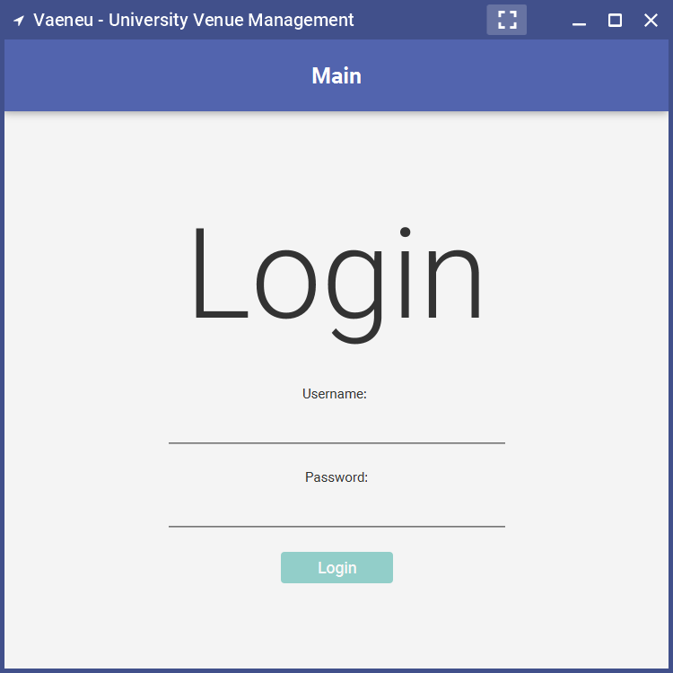

#### Login failed

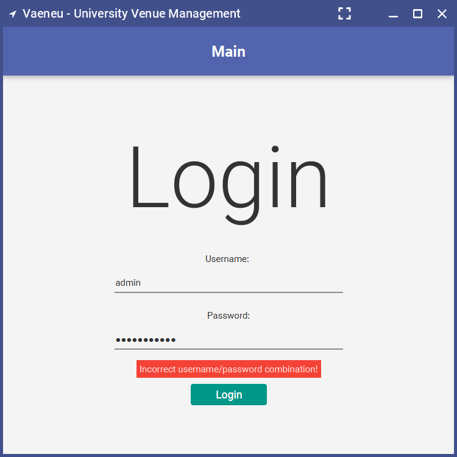

### Logout

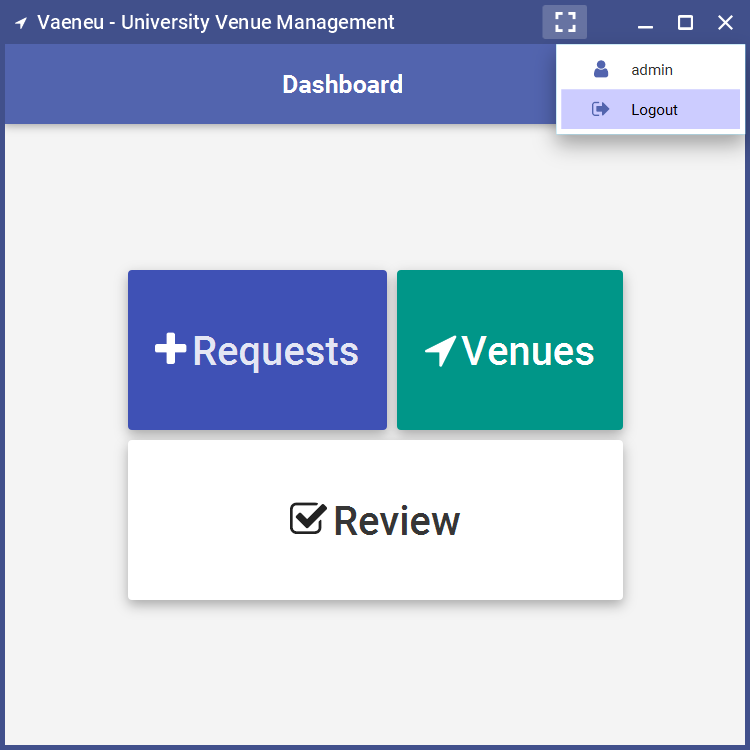

### Dashboard

#### Admin

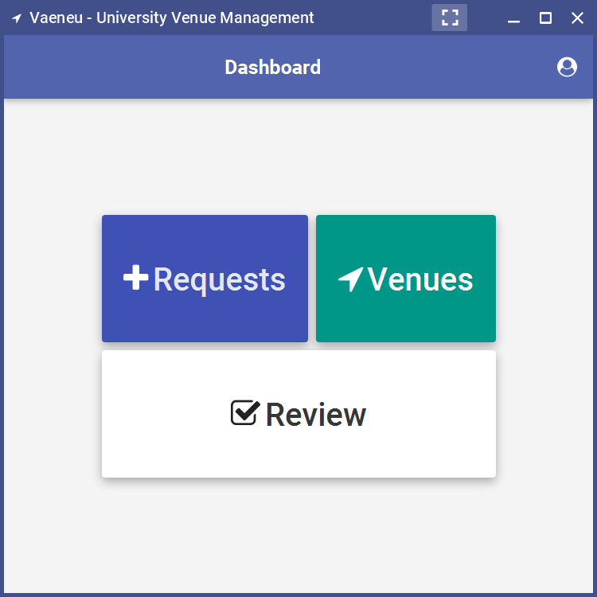

#### User

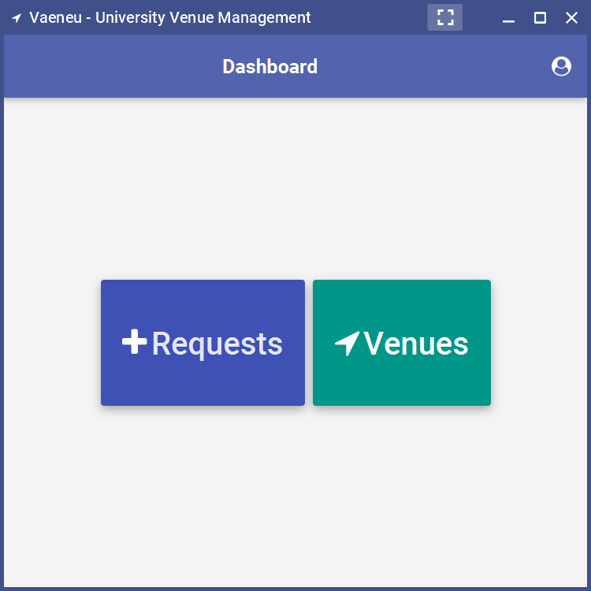

### Requests

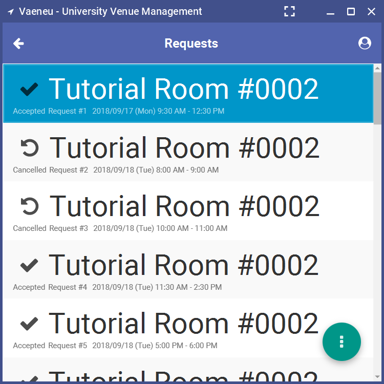

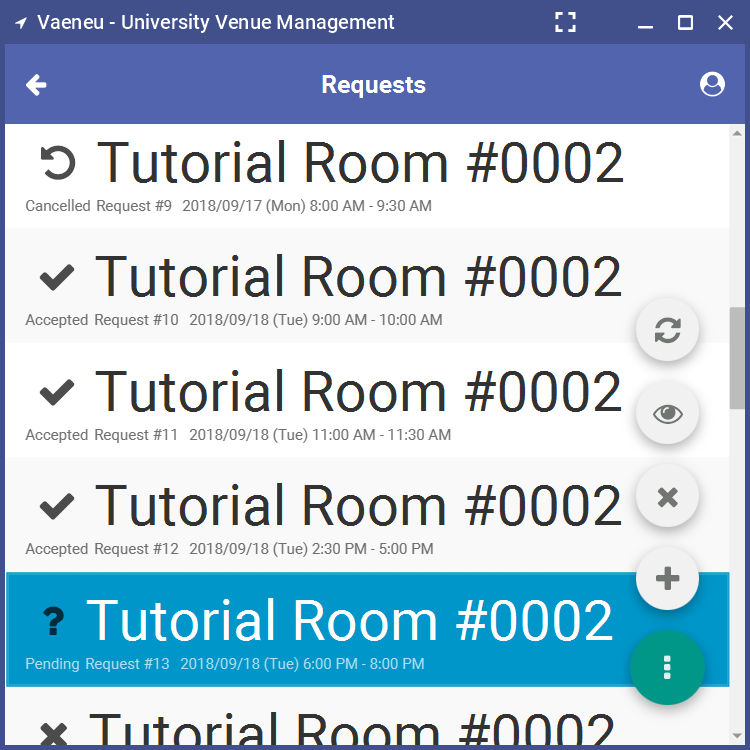

### Add new venue

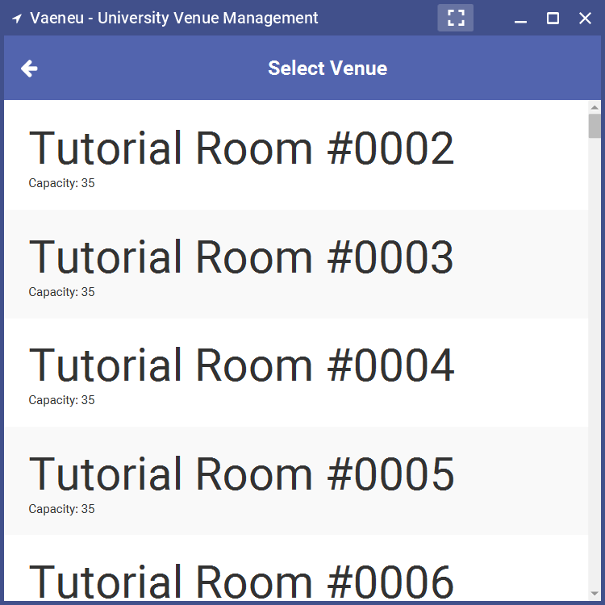

#### No available time slots

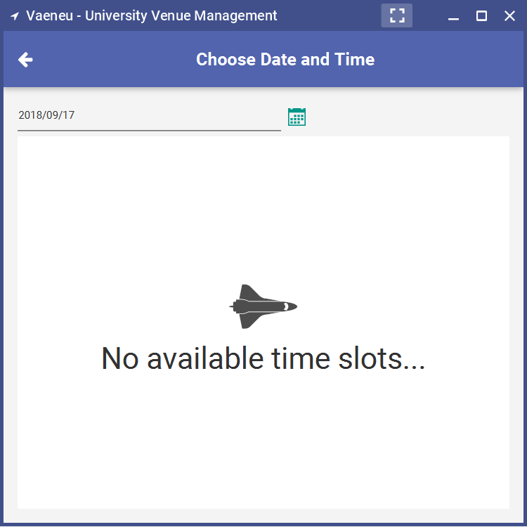

#### Change date

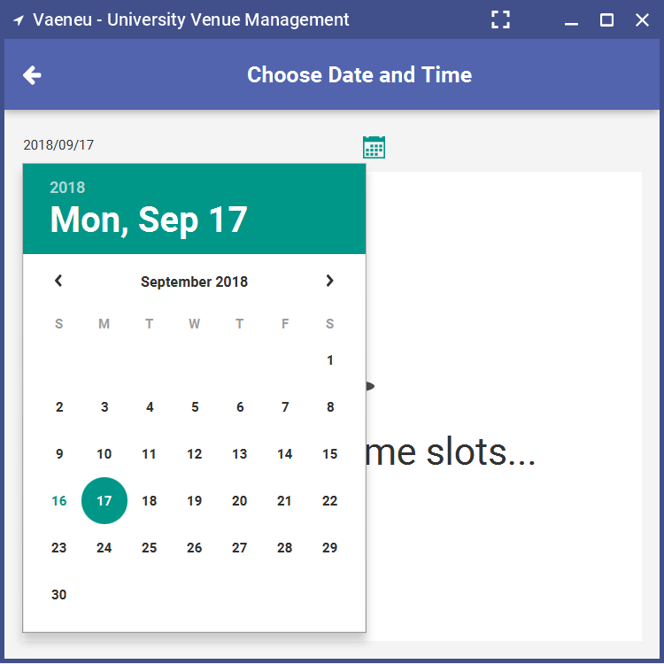

#### Select time slot

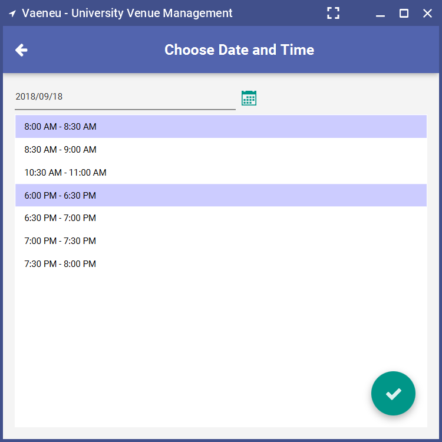

#### Confirm request

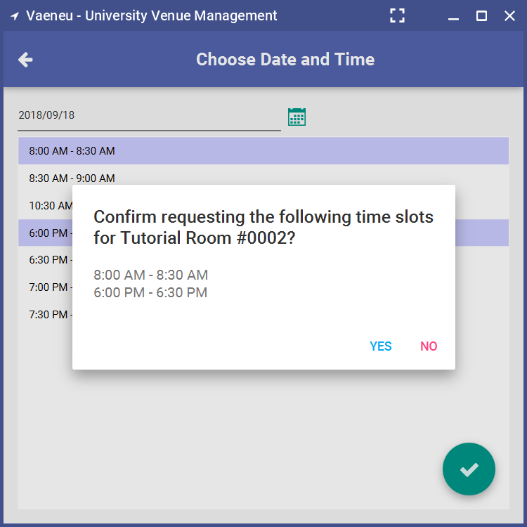

#### Request details

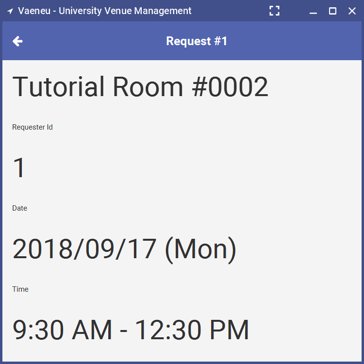

### Venues

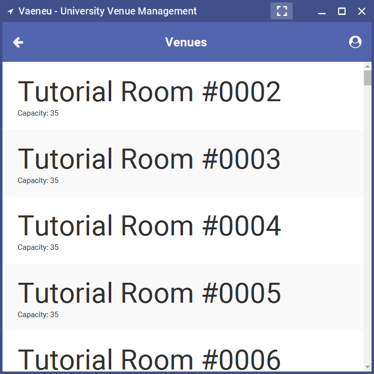

#### Venue details

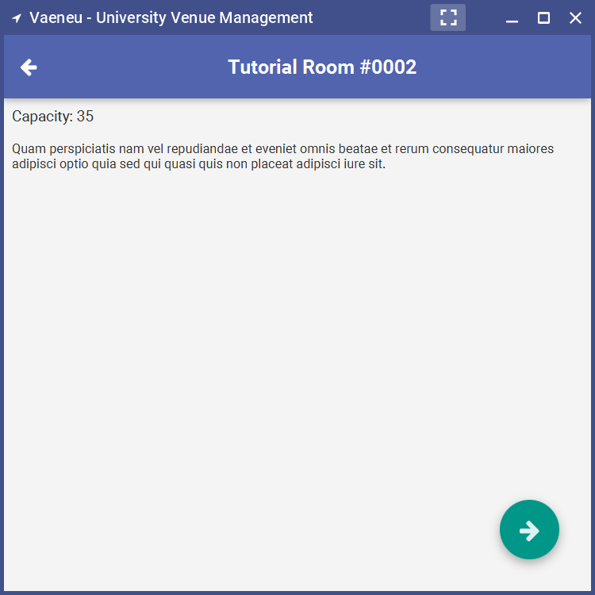

### Pending requests

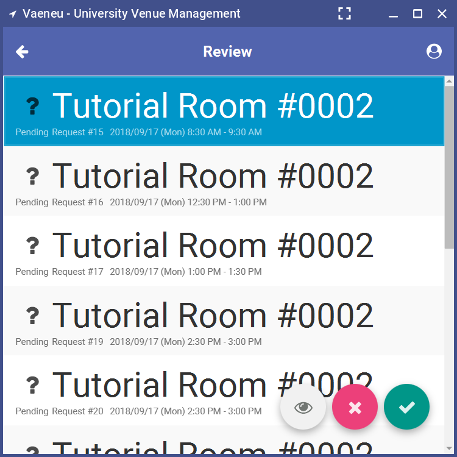

#### Accept all requests

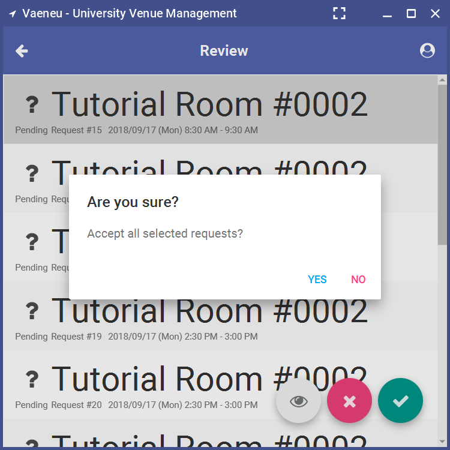

#### Reject all requests

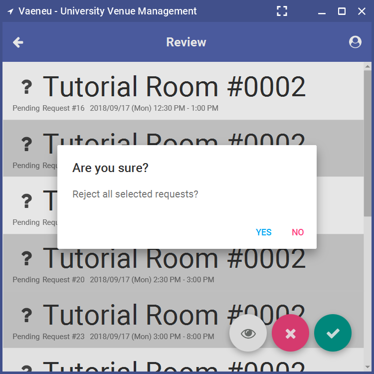

## Others

This project is made for my `TOP2121 Object Oriented Programming` subject.